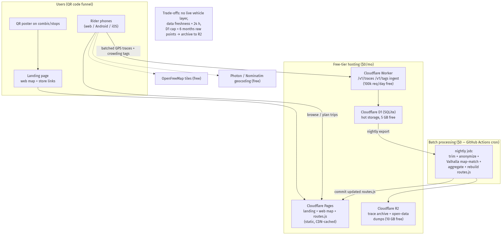
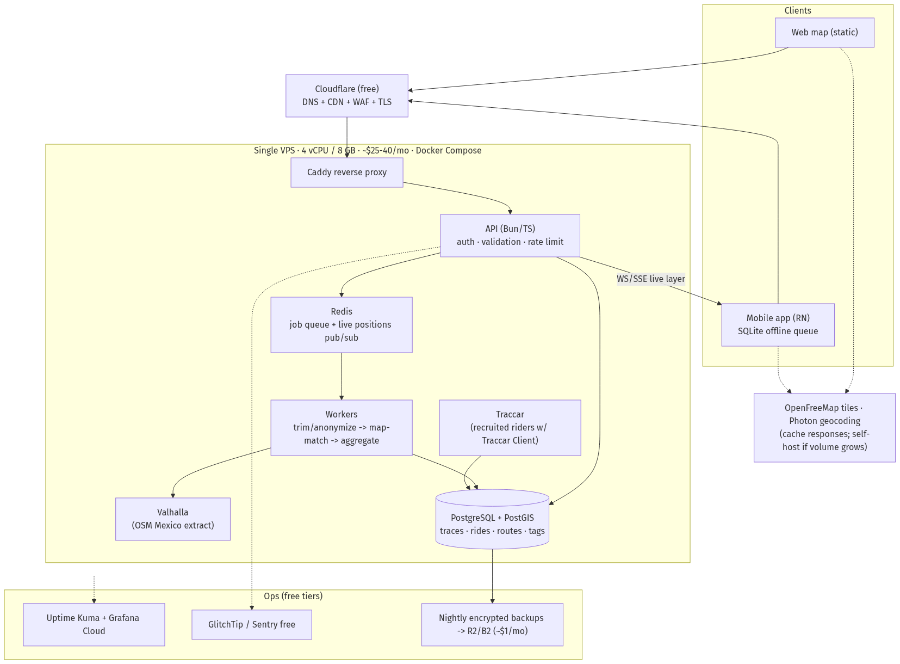
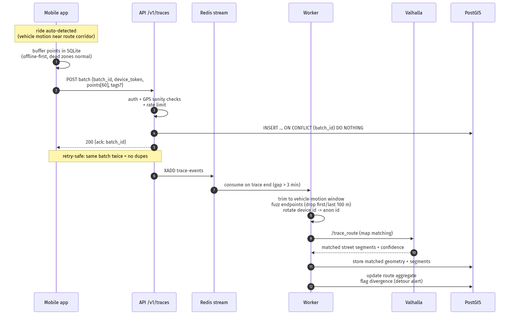
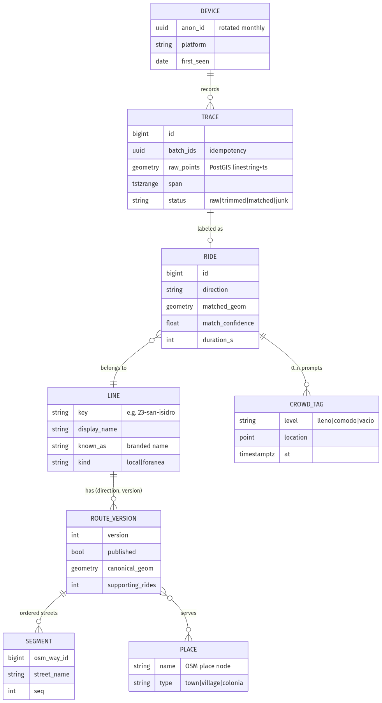

# System Design — Combi Tracker ("build Uber for informal transit, backwards")

*Interview-style design: estimate the load, state the requirements, size two architectures, defend the trade-offs.*

Date: 2026-07-14 · Companion docs: `[PRD.md](../PRD.md)`, `[PRD-mobile.md](../PRD-mobile.md)`, `[SECURITY.md](../SECURITY.md)`

---

## 1. Problem statement

Mexican cities run on combis — informal van networks with no official map, no schedules, no GTFS. We crowdsource the map: a free app (web + Android + iOS, all open source) that lets riders **find and plan combi trips**, while consenting users' phones **passively contribute GPS traces and crowding tags** that continuously correct and enrich the map. Distribution is QR stickers placed on combis and stops — by us, for free, city by city.

The interesting inversion vs. "build Uber": Uber knows where its cars are and sells rides; we don't know where the vans are and give the answer away. Our writes are *donations*, so the system must be cheap, trustworthy, and privacy-clean — or the donations stop.

## 2. Functional requirements

1. **Browse** all routes on a map; search by route number, branded name («San Isidro»), colonia, or town (accent/partial tolerant).
2. **Plan** A→B trips (geocoded or map-picked): direct + one-transfer options ranked by walk+ride; never returns "no results" — always the nearest-combi answer with honesty flags.
3. **Collect** passively (opt-in): auto-detected ride traces, boarding/alighting times, detour evidence; one-tap crowding tags (lleno/cómodo/vacío).
4. **Process**: trim → anonymize → map-match (Valhalla/OSM) → aggregate into versioned canonical routes; auto-flag divergence (detours / stale geometry).
5. **Publish**: static route bundle consumed by all clients; open-data exports (GeoJSON/GTFS); later a live layer ("combi passed here 6 min ago").

## 3. Non-functional requirements

| Requirement   | Target                                                                  | Why                                                      |
| ------------- | ----------------------------------------------------------------------- | -------------------------------------------------------- |
| Cost          | Tier 0: ~$0/mo · Tier 1: ≤$40/mo                                        | free product, donated data, no revenue                   |
| Availability  | 99.5% API; **map itself must survive total backend outage**             | clients cache the route bundle; reads are static-first   |
| Latency       | p95: bundle &lt; 300 ms (CDN), plan &lt; 500 ms, ingest ack &lt; 400 ms | plan runs client-side today; keep it feeling instant     |
| Durability    | a rider's trace, once ACKed, is never lost                              | it may be the only recording of that route variant       |
| Offline-first | full function without connectivity except geocoding/live                | dead zones + no-credit riders are the norm, not the edge |
| Privacy       | no PII; anonymized traces; endpoint fuzzing; raw data never published   | location traces reveal homes/patterns; see SECURITY.md   |
| Battery       | &lt; 3%/ride collection overhead                                        | or users uninstall                                       |
| Openness      | all code public; data exports public; secrets/infra config private      | stated project goal                                      |

## 4. Scale estimation (show your work)

**Population → riders → users:**

- Tehuacán metro ≈ 400k people; combis are the dominant mode. Conservatively ~35% ride on a given day ≈ **140k daily riders**, ~1.6 trips each ≈ **220k passenger-trips/day** across ~80 routes.
- Smartphone penetration among riders ~70%. Adoption is **sticker-gated** (see §5): we place QR stickers ourselves, so growth is throttled by our own rollout — a deliberate control knob, not a marketing guess.

**Sticker math (the unit is a stickered *van*, not a poster).** A field day = one corridor,
11:00–18:00, pitching every driver of the ~4 routes that pass there. City circuits run ~50 min
with ~12–15 active vans/route, so real headways are 3–5 min (Moovit's "20 min" is template
junk) — a combi arrives every 1–2 min, but the same vans lap the corridor every ~50 min. The
entire active fleet of 4 routes ≈ **48 unique vans**, all encountered within the first 1–2 h
(each van laps ~8×, so a morning "no" gets re-pitched by afternoon). At **50% driver
acceptance → ~24 stickered vans per field day**; fleet size, not time, is the constraint.
Each stickered van carries ~240 riders/day (220k trips ÷ ~900 vans) with 15–20 min of captive
staring time; at a 1–3% scan rate that's **~3–7 scans/day/van, recurring** — an in-van sticker
is an impression machine, not a one-shot poster. Wear/removal attrition ~20–25%/quarter →
re-sticker passes are standing maintenance.

| Phase | Stickered vans (field days) | Scans/day | MAU (unique openers/mo) | **DAU** | Design point |
| --- | --- | --- | --- | --- | --- |
| Pilot (month 1: R1–R4, 1 corridor day + re-pitch pass) | ~24 vans (1–2 days) | ~75–170 | 1.5–2.5k | **250–400** | Tier 0 loafs; verify funnel + sticker attrition |
| City rollout (months 2–6, ~20 corridor days) | ~475 vans, all 79 routes | ~2.4k | 12–18k | **2.5–4k** | Tier 0 nears D1/Workers caps → schedule Tier 1 migration |
| Mature Tehuacán (month 9+, re-sticker maintenance) | ~50% fleet sustained | steady | 40k (~10% of riders) | **8–10k** | Tier 1 design point |
| +2 nearby cities (same protocol) | ~1,000 vans | — | 100k | **25k** | Tier 1 still fine; revisit at §9 triggers |

*Assumptions to verify in the pilot (each changes the funnel ~2×): 50% driver acceptance,
1–3% scan rate, 40–60% scan→return conversion, DAU/MAU ≈ 15–25% for a habitual-transit tool.
The pilot exists to replace these guesses with measurements before the other ~75 routes.*

**Load at the 10k-DAU design point:**

| Flow                 | Math                                                                                                    | Avg      | Peak (×8, 7–9am)                        |
| -------------------- | ------------------------------------------------------------------------------------------------------- | -------- | --------------------------------------- |
| Route bundle fetch   | 10k × 1.2/day, ~150 KB gzip, CDN-cached                                                                 | 0.14 QPS | ~1 QPS *(CDN absorbs; origin ~0)*       |
| Trip plans           | 10k × 2/day (client-side against cached bundle)                                                         | —        | API cost ≈ 0; geocode ~0.25 QPS → cache |
| **Telemetry writes** | 20% of DAU ride-contribute: 2k rides × 40 min × 6 pts/min = **480k pts/day**, batched ×60 → 8k reqs/day | 0.1 QPS  | ~1 QPS                                  |
| Crowding tags        | 2k/day                                                                                                  | ~0       | ~0                                      |
| Live layer (v2)      | ≤ 800 concurrent WS at peak, msg fan-out per route channel                                              | trivial  | ~200 msg/s                              |

**Storage:** 480k pts/day × ~45 B ≈ **22 MB/day raw** → 8 GB/yr; ×3 with indexes + matched geometries ≈ **25 GB/yr**. Retention policy (raw 90 days → aggregates only) caps steady-state under ~10 GB.

**The punchline every candidate should say out loud:** at city scale this is a *small system*. Peak write QPS ≈ 1. A single Postgres on a $25 VPS has ~100× headroom. The design difficulty is not throughput — it's **offline correctness, idempotency, privacy, and the data pipeline**. We size for honesty, not for imaginary scale.

## 5. Growth model: sticker-gated rollout

QR stickers are free to place (Michael places them personally), which gives us a rare luxury: **load ramps only when we choose**. Rollout protocol:

1. Place stickers on 2 routes → watch pilot metrics for 2 weeks (ingest error rate, trace quality, battery complaints, cost).
2. Each verification gate passed → next batch of stickers.
3. The landing page behind the QR serves the web map instantly (no install wall) and offers the store links — so every scan yields value even at 0% install rate, and telemetry consent is a later, separate ask.

This converts the classic interview guess ("assume 1M DAU") into a measured dial, and it means **Tier 0 → Tier 1 migration is a planned event**, not an emergency.

## 6. Architecture — Tier 0: the $0/month version

Everything static lives on **Cloudflare Pages** (landing + web map + `routes.js` bundle). Ingest is a single **Cloudflare Worker** writing to **D1**; free quotas (100k req/day) exceed pilot load by ~50×. Processing is a **nightly GitHub Actions job**: pull new traces, trim/anonymize, map-match against Valhalla (runs in the Action container with the OSM Mexico extract), aggregate, commit the regenerated `routes.js` — the "deploy" of new map data is a git commit. Archives and open-data dumps go to **R2**.

**Consciously accepted trade-offs:** no live layer; 24 h data freshness; D1's 5 GB ≈ 6 months of raw points before archival; GH Actions as cron is quirky. **Kept:** offline-first clients, idempotent ingest, full privacy pipeline — the things that can't be retrofitted.

## 7. Architecture — Tier 1: best practices at our DAU (~$25–40/mo)

One 4 vCPU / 8 GB VPS, Docker Compose, ~10 containers; Cloudflare (free) in front for CDN/WAF/TLS. Postgres+PostGIS is the system of record; Redis carries the job queue and live-position pub/sub; workers run the trim→match→aggregate pipeline continuously (freshness minutes, not a day); Valhalla and Traccar (for recruited riders) ride along. Ops on free tiers: Uptime Kuma + Grafana Cloud, GlitchTip/Sentry, nightly **encrypted** backups to R2/B2 with quarterly restore drills.

Why this is "best practice" *for this DAU* and not a k8s cluster: single-digit QPS with 100× headroom on one box; every added component must pay rent in reliability. The availability trick is architectural, not redundant hardware — **reads don't need the backend** (bundle on CDN + client-side planner), so an API outage degrades to "yesterday's map," which is still better than anything else in the city.

## 8. Key design decisions (the deep dives)

### 8.1 Write path — idempotent, offline-first ingest

Phones buffer to SQLite and upload 60-point batches keyed by client-generated `batch_id`; the server does `INSERT … ON CONFLICT DO NOTHING` and ACKs. Retries after dead zones can't duplicate; the client deletes local data only on ACK (durability). Trace assembly keys on **GPS timestamps, not arrival time** — a ride uploaded 6 hours later over Wi-Fi assembles identically. Privacy transforms (§SECURITY.md) run *before* anything hits long-term storage: vehicle-motion trim, 100 m endpoint fuzz, monthly-rotating anonymous IDs.

### 8.2 Read path — static-first

The route bundle (~150 KB gz: geometries + names + places + colonias) is a build artifact on the CDN, versioned with content hashes. Clients cache it and plan trips locally (the same nearest-segment + one-transfer algorithm the web map runs today). The API serves only what can't be static: geocoding proxy (cached), live layer, ingest.

### 8.3 Trip search

Client-side over the bundle: meter-space projection, nearest-segment per route, direct + one-transfer generation with tiered walk radii (700 m → 1.3 km → nearest-anyway with ⚠ flags). At 80 routes / ~25k points this is &lt;30 ms on a low-end phone. *Trigger to move server-side:* multi-city bundles &gt; a few MB or graph-accurate transfer routing.

### 8.4 Data model

The pipeline is a status ladder (`raw → trimmed → matched → aggregated`) with provenance at every hop; canonical routes are **versioned**, publish is an explicit flip, and every version knows its supporting rides — so a bad aggregate is a one-row rollback, and "how do we know this route?" is always answerable.

### 8.5 Detour &amp; freshness intelligence (the moat)

Every matched ride diffs against the published canonical route. Divergence &gt; threshold on N recent rides → auto-flag "route changed / detour", surface on map, queue for re-verification. This is what fixes the San Isidro problem *systemically* — the 2023 citizen maps rot, ours self-heals.

## 9. Scaling triggers (what we deliberately don't build yet)

| Signal                                          | Response                                               |
| ----------------------------------------------- | ------------------------------------------------------ |
| Sustained ingest &gt; 50 QPS or DB CPU &gt; 60% | split DB to managed Postgres; API horizontal behind LB |
| Bundle &gt; 3 MB (multi-city)                   | per-city bundles + server-side search index            |
| Live subscribers &gt; 10k                       | dedicated WS tier, shard channels by geo-tile          |
| Geocode volume upsets Photon/Nominatim          | self-host Photon (~2 GB RAM, same VPS class)           |
| Multi-region ops burden                         | this is the k8s/Kafka conversation — not before        |

## 10. Cost summary

|                  | Tier 0                                   | Tier 1                       |
| ---------------- | ---------------------------------------- | ---------------------------- |
| Hosting          | $0 (CF Pages/Workers/D1/R2 + GH Actions) | ~$25–40/mo VPS + ~$1 backups |
| Tiles/geocoding  | $0 (OpenFreeMap / Photon, cached)        | $0 (self-host option ready)  |
| Stores           | $99/yr Apple +$25 Google (unavoidable)   | same                         |
| Stickers         | free (self-placed)                       | free                         |
| **Total year 1** | **≈ $124**                               | **≈ $525**                   |

